# WAPH-Web Application Programming and Hacking

## Instructor: Dr. Phu Phung

## Student

**Name**: Ruthvik Suvarnakanti

**Email**: suvarnrk@mail.uc.edu


## Hackathon 1: Cross-Site Scripting Attacks and Defenses

**Overview**: The Hackathon centers around understanding and addressing XSS (Cross-Site Scripting) attacks, with participants engaging in two distinct tasks. In the Attack Phase (Task 1), participants are tasked with uncovering and exploiting XSS vulnerabilities within a designated website (http://waph-hackathon.eastus.cloudapp.azure.com/xss/). This site is structured with six levels of vulnerabilities, designed to provide insight into the mechanics of XSS attacks. Following this, in the Defense Phase (Task 2), participants focus on implementing secure coding practices to mitigate XSS threats. Guided by OWASP guidelines, they learn techniques such as input validation and output sanitization to fortify their applications against XSS vulnerabilities effectively. Upon completing both phases, participants document their discoveries and solutions using Markdown format. Utilizing tools like Pandoc, they generate a comprehensive PDF report detailing their experiences, including the vulnerabilities identified, exploitation methods employed, and the strategies adopted to mitigate risks. Overall, the Hackathon serves as a practical learning platform, offering participants hands-on experience in identifying, exploiting, and safeguarding against XSS vulnerabilities, thus fostering a deeper understanding of web security protocols.

Link to the repository:
[https://github.com/suvarnrk/waph-suvarnrk/blob/main/labs/hackathon1/README.md](https://github.com/suvarnrk/waph-suvarnrk/blob/main/labs/hackathon1/README.md)

\pagebreak

## Task 1 : ATTACKS

### Level 0

URL : [http://waph-hackathon.eastus.cloudapp.azure.com/xss/level0/echo.php](http://waph-hackathon.eastus.cloudapp.azure.com/xss/level0/echo.php)

attacking script :
```JS
<script>alert("Level 0 : hacked by Ruthvik Suvarnakanti")</script>
```

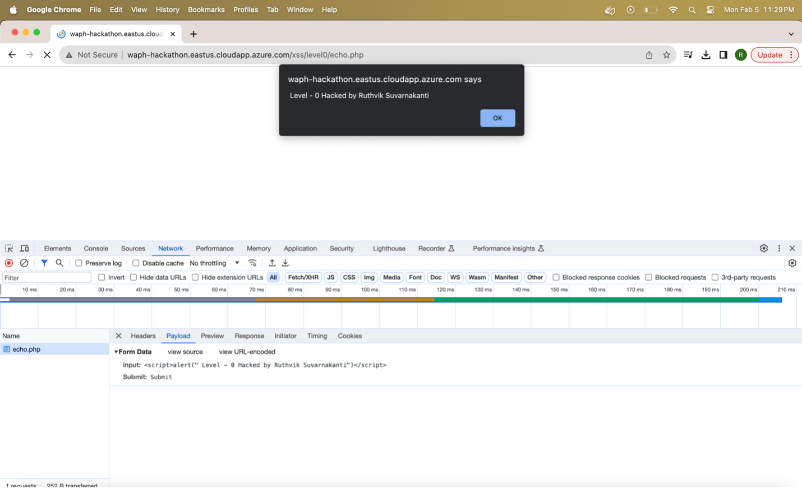

\pagebreak

### Level 1

URL : [http://waph-hackathon.eastus.cloudapp.azure.com/xss/level1/echo.php](http://waph-hackathon.eastus.cloudapp.azure.com/xss/level1/echo.php)

attacking script is passed as a pathvariable at the end of the URL
```JS
?input=<script>alert("Level 1: Hacked by Ruthvik Suvarnakanti")</script>
```
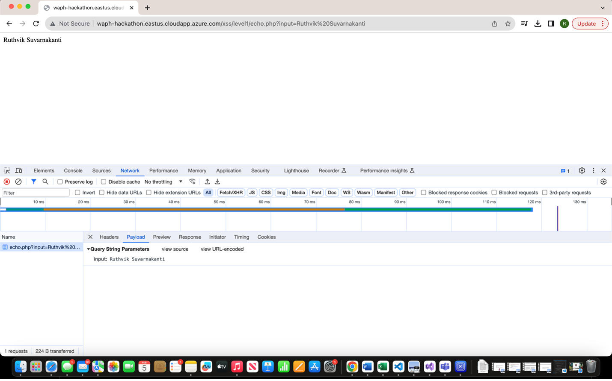

\pagebreak

### Level 2

URL : [http://waph-hackathon.eastus.cloudapp.azure.com/xss/level2/echo.php](http://waph-hackathon.eastus.cloudapp.azure.com/xss/level2/echo.php)

Since the HTTP request for this URL doesn't provide an input field or accept path variables, a workaround was needed. The URL was linked to a simple HTML `<form>`. Through this form, the attacking script is transmitted. This method allows for a more structured and controlled injection of malicious scripts, aiding in the exploration and exploitation of XSS vulnerabilities within the web application. By embedding the attacking script directly into the form submission, participants can interact with the website and observe how their injected code affects it. This approach ensures that XSS attacks are carried out within the web application's environment, giving participants a clearer understanding of the vulnerabilities and their potential consequences for the application's security.
```JS
<script>alert("Level 2: Hacked by Ruthvik Suvarnakanti")</script>
```
Source code Guess of echo.php:
```JS
if(!isset($_POST['input'])){
   die("{\"error\": \"Please provide 'input' field in an HTTP POST Request\"}");
echo $_POST['input'];
```
 
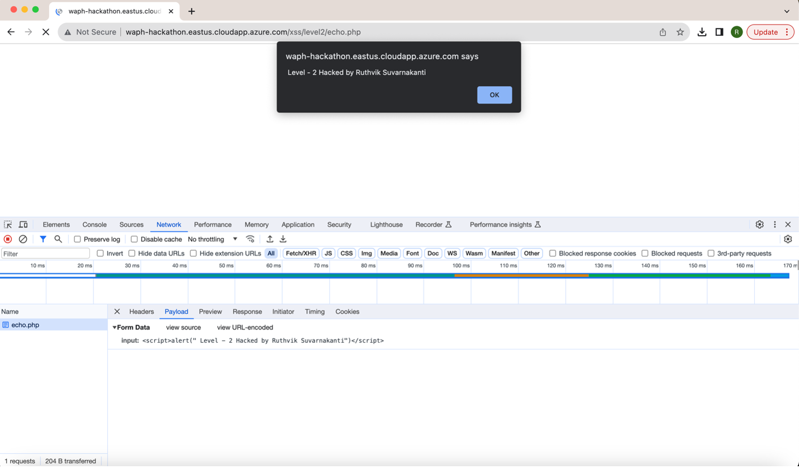

\pagebreak

### Level 3

URL : [http://waph-hackathon.eastus.cloudapp.azure.com/xss/level3/echo.php](http://waph-hackathon.eastus.cloudapp.azure.com/xss/level3/echo.php)

 In this level, if the `<script>` tag is directly passed in the input variable, it is filtered out. Therefore, to carry out an attack on this URL, the malicious code had to be divided into multiple parts and then appended together to trigger an alert on the webpage. This approach bypasses the filtering mechanism and allows the attacker to execute their payload successfully.

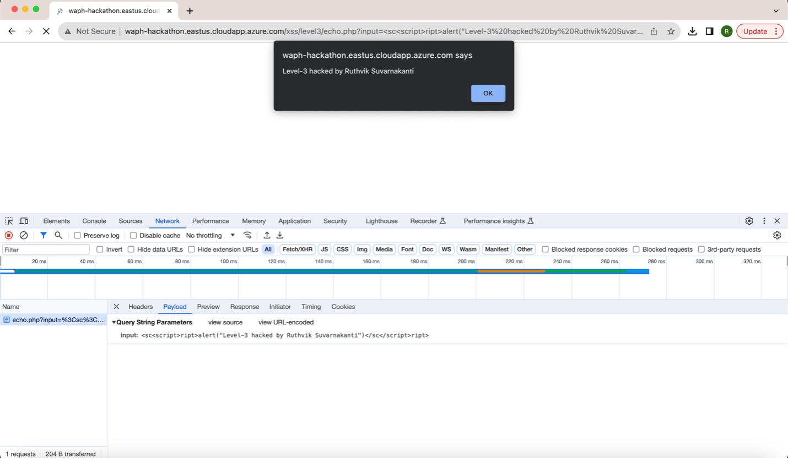
 
```JS
?input=<script<script>>alert("Hacked by Ruthvik Suvarnakanti")</scrip</script>t>

```
Source code Guess of echo.php:

 ```
str_replace(['<script>', '</script>'], '', $input)
```

\pagebreak

### Level 4

URL : [http://waph-hackathon.eastus.cloudapp.azure.com/xss/level4/echo.php](http://waph-hackathon.eastus.cloudapp.azure.com/xss/level4/echo.php)

In this level, the filtering mechanism completely blocks the `<script>` tag, even if it's attempted by breaking the string and concatenating it. To inject the XSS script, I utilized the `onerror()` attribute of the `` tag. By leveraging this attribute, I triggered an alert to be raised on the webpage. This approach circumvents the filtering mechanism, allowing the XSS script to execute successfully.

```JS
?input=
```
Source code guess of echo.php:

```JS
$data = $_GET['input']
if (preg_match('/<script\b[^>]*>(.*?)<\/script>/is', $data)) {
    exit('{"error": "No \'script\' is allowed!"}');
	}
else
	echo($data);

```
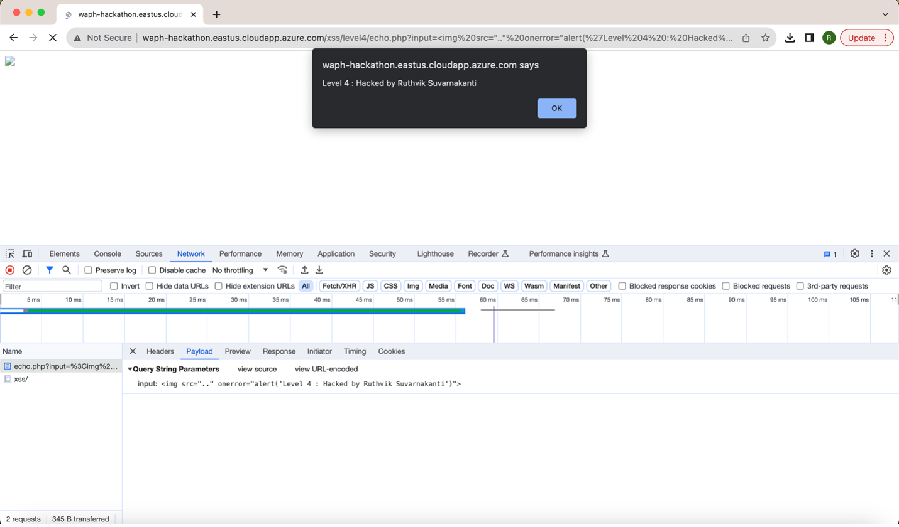

\pagebreak

### Level 5

URL : [http://waph-hackathon.eastus.cloudapp.azure.com/xss/level5/echo.php](http://waph-hackathon.eastus.cloudapp.azure.com/xss/level5/echo.php)

In this level, both the `<script>` tag and the `alert()` method are filtered out. To trigger a popup alert, I employed a combination of Unicode encoding and the `onerror()` method of the `` tag. By utilizing these techniques together, I successfully raised a popup alert on the webpage. This method effectively bypasses the filtering mechanisms in place, allowing the XSS payload to execute.

```JS
?input=
```

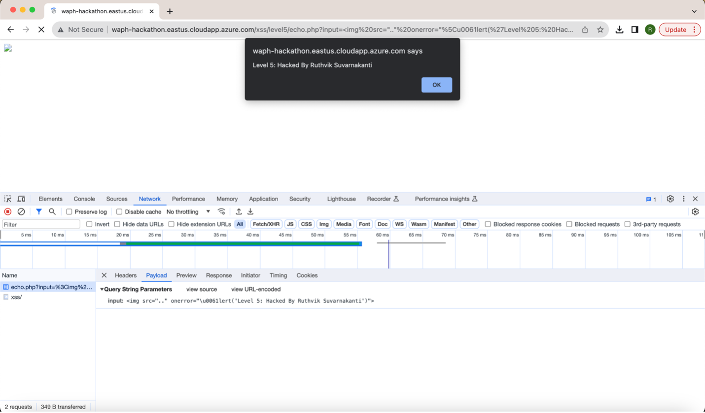


\pagebreak

### Level 6

URL : [http://waph-hackathon.eastus.cloudapp.azure.com/xss/level6/echo.php](http://waph-hackathon.eastus.cloudapp.azure.com/xss/level6/echo.php)

In this level, user input is accepted, but it appears that the source code utilizes the `htmlentities()` method to convert all relevant characters into their corresponding HTML entities. This ensures that the user input is rendered strictly as text on the webpage.
To trigger an alert on the webpage in this scenario, I utilized JavaScript event listeners such as `onmouseover()`, `onclick()`, and `onkeyup()`. Specifically, I opted for the `onkeyup()` event listener, which generates the alert on the webpage whenever a key is pressed within the input field. This approach allowed me to bypass the HTML entity conversion and successfully execute the desired action.

```JS
	/" onkeyup="alert('Level 6 : Hacked by Ruthvik Suvarnakanti')"
```
on passing the above script in the url , this will append to the code and manipulates the input form element as below.

```HTML
<form action="/xss/level6/echo.php/"
	onkeyup="alert('Level 6 : Hacked by Ruthvik Suvarnakanti')" method="POST">
  Input:<input type="text" name="input" />
  <input type="submit" name="Submit"/>
```
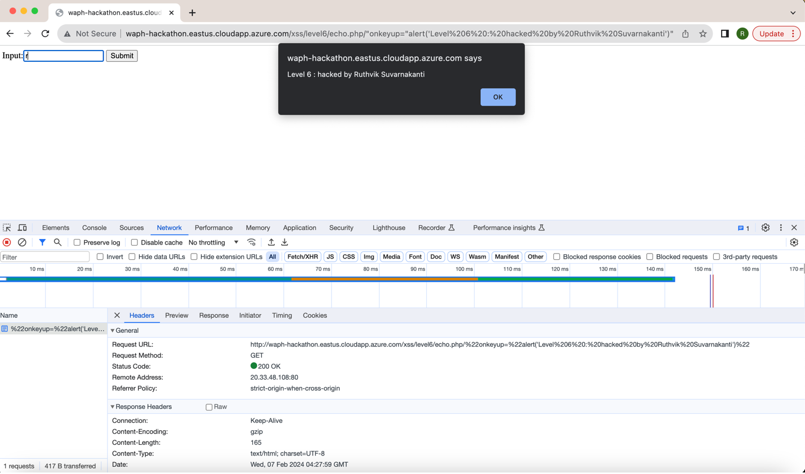

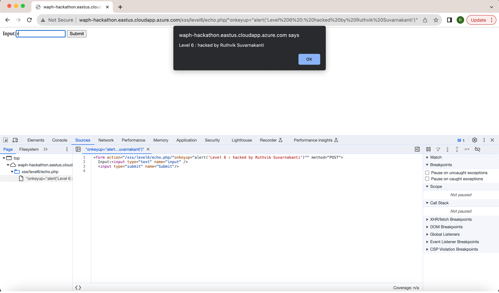

source code guess of echo.php:
```JS
	echo htmlentities($_REQUEST('input'));
```
\pagebreak

## TASK 2 : DEFENSE

### A . echo.php

The `echo.php` file in Lab 1 has been updated to include input validation and XSS defense measures. Initially, it checks whether the input is empty. If it is, the PHP execution stops. If the input is valid, the `htmlentities()` function is utilized to sanitize the input data. This function converts special characters into their HTML entities, ensuring that the text is displayed as plain text on the webpage. This action serves to protect against XSS attacks by neutralizing any potentially harmful scripts embedded within the input.

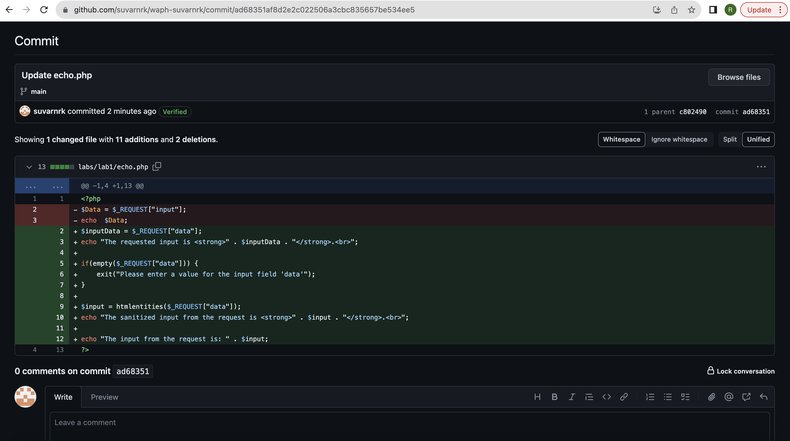

```JS
if(empty($_REQUEST["data"])){
        exit("please enter the input field 'data'");
        }
    $input=htmlentities($_REQUEST["data"]);
    echo ("The input from the request is <strong>" .$input. "</strong>.<br>");
```


\pagebreak

### B . Lab 2 front-end part

The `waph-suvarnrk.html` file underwent a thorough review and update, focusing on identifying and securing areas where external input is accepted. Validation procedures were implemented to ensure the integrity of input data, while measures were taken to sanitize output text to enhance security.
**i)** In particular, when dealing with HTTP GET and POST request forms, input data is meticulously validated. A new function named `validateInput()` was introduced for this purpose. This function mandates that users provide input text before executing their request. This precautionary measure significantly reduces the risk of receiving invalid or potentially malicious input, thereby fortifying the overall security posture of the application.

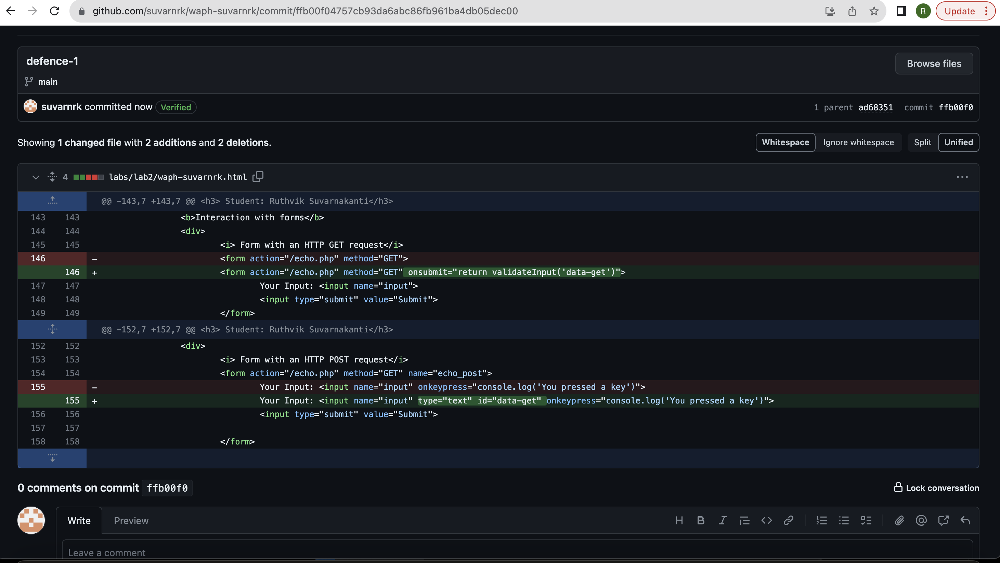

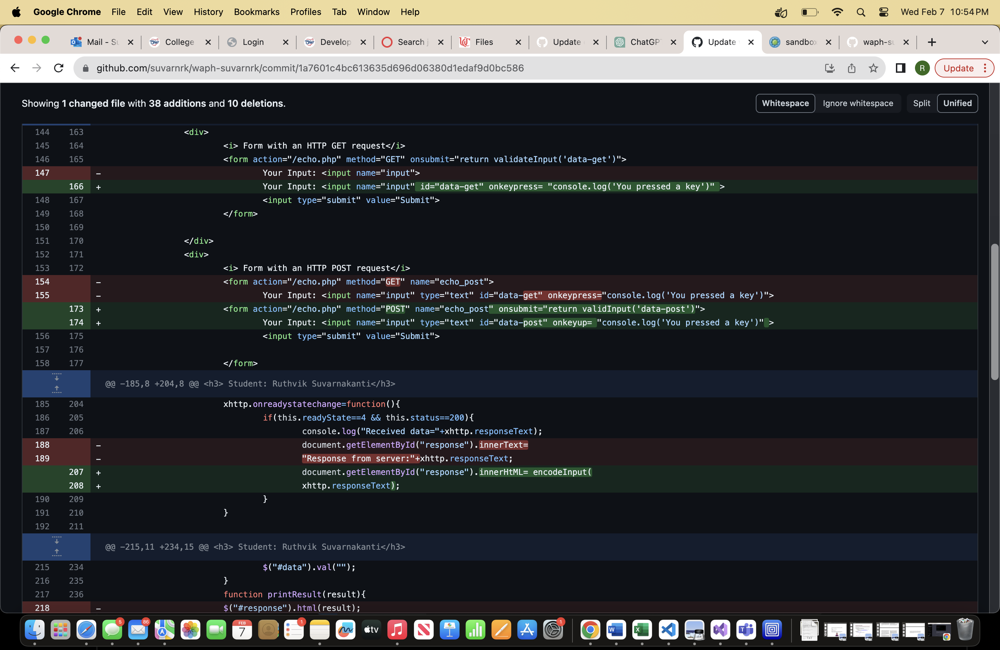

\pagebreak

**ii)** In the code, we made a change from using `.innerHTML` to `.innerText` in situations where HTML rendering wasn't necessary, and only plain text needed to be shown. This adjustment ensures that any text content is treated strictly as text, without any interpretation of HTML tags or rendering of elements. By using `.innerText`, we reduce the risk of unintended HTML injection or XSS vulnerabilities, making the display of text content safer within the application.

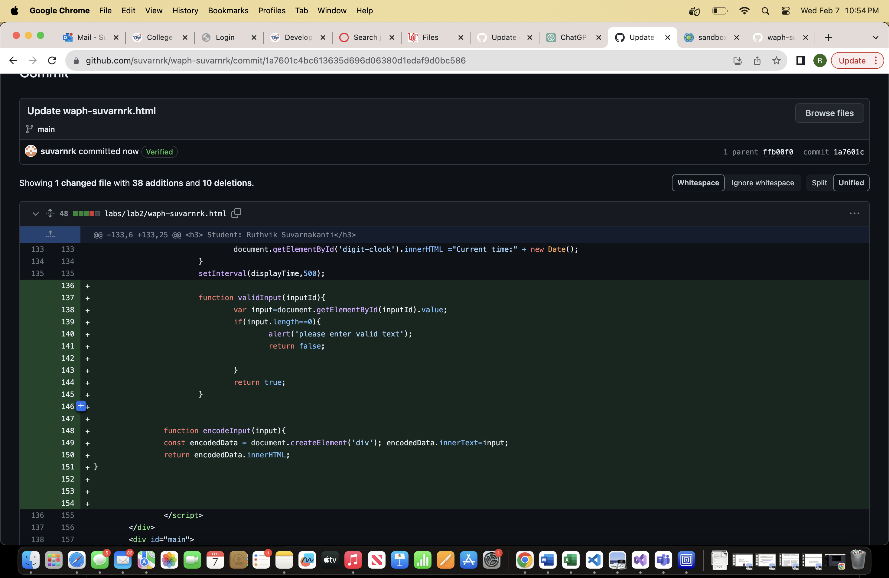


\pagebreak

**iii)** A new function called `encodeInput()` was introduced to sanitize the response. This function converts special characters into their respective HTML entities before inserting them into the HTML document, thereby preventing cross-site scripting attacks. This ensures that the content is displayed purely as text and cannot be executed.
Moreover, the code creates a new `<div>` element and inserts the content as `innerText` into this newly created element. Subsequently, this content is returned as the HTML content.
This method guarantees that any potentially harmful content is properly encoded and displayed securely within the HTML document, thus reducing the risk of XSS vulnerabilities. Utilizing `innerText` ensures that the content is treated strictly as text, preventing any unintended HTML rendering or script execution.

```JS
function encodeInput(input){
			const encodedData = document.createElement('div');
			encodedData.innerText=input;
			return encodedData.innerHTML;
		}
```


\pagebreak

**iv)** Additional validations have been introduced for the API [https://v2.jokeapi.dev/joke/Programming?type=single](https://v2.jokeapi.dev/joke/Programming?type=single), used to fetch jokes. These validations now verify if the received result and the `result.joke` in the JSON response are not empty. If either of these values turns out to be null or empty, an error message is generated. This enhancement ensures that only valid and non-empty joke data is handled and presented, thereby enhancing the application's reliability and user experience.

```JS
if (result && result.joke) {
		var encodedJoke = encodeInput(result.joke);
		$("#response").text("Programming joke of the day: " +encodedJoke);
				}
else{
		 $("#response").text("Could not retrieve a joke at this time.");
}
```

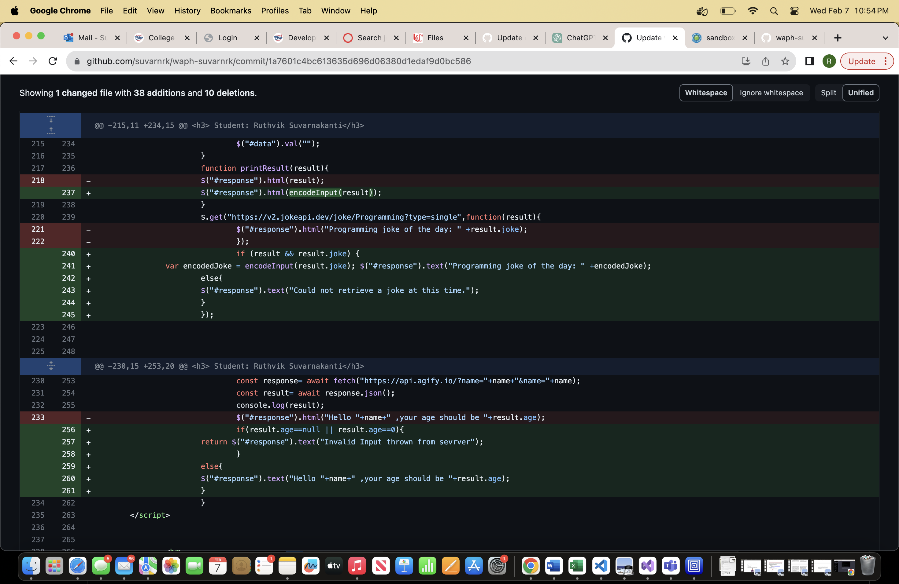

\pagebreak

**v)** In the asynchronous function `guessAge()`, new validations have been added. These validations ensure that both the received result and the user-entered input are not empty, null, or equal to 0. If either the result or the input is found to be in such a state, an error message is thrown. These measures are put in place to uphold data integrity and guarantee the proper functioning of the function across different scenarios, thereby improving its reliability and usability.

```JS
if(result.age==null || result.age==0)
   return $("#response")
   .text("Sorry, the webserver threw an error cannot retrieve your age");
$("#response").text("Hello "+name+" ,your age should be "+result.age);
```

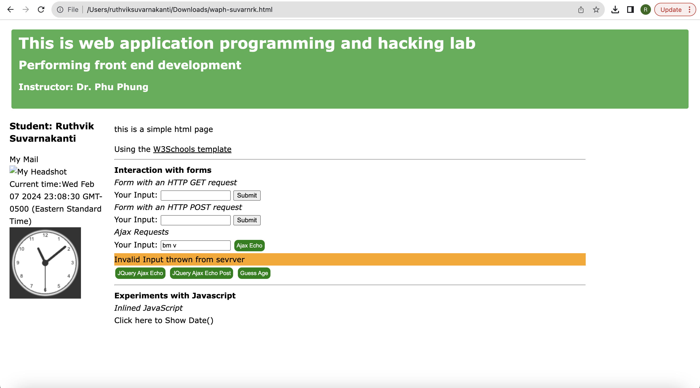


