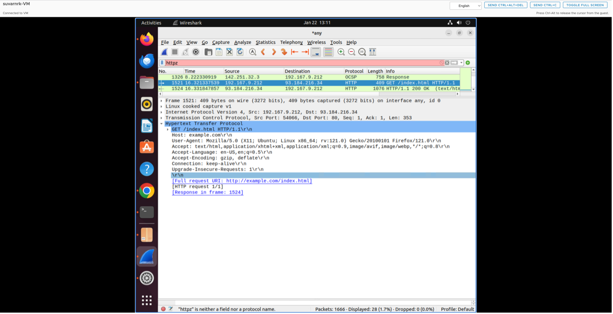
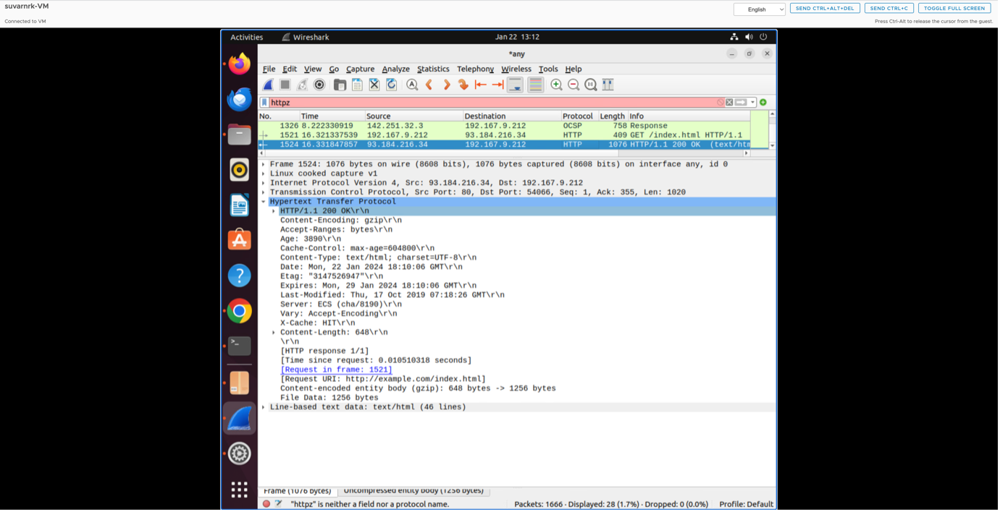
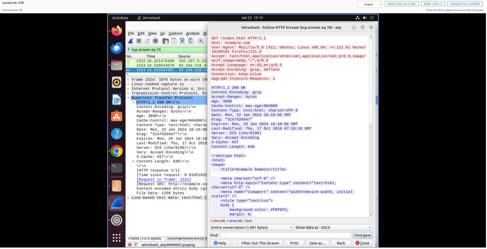
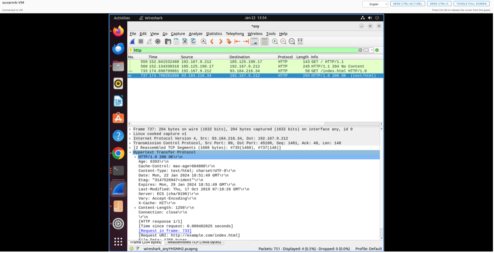
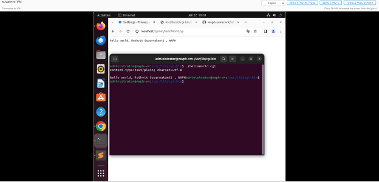
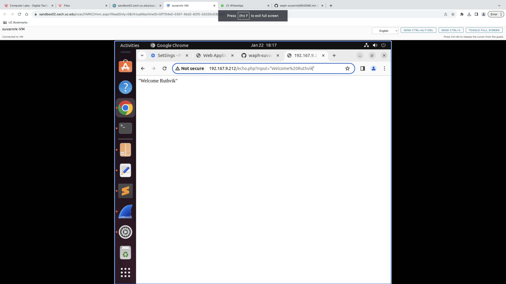
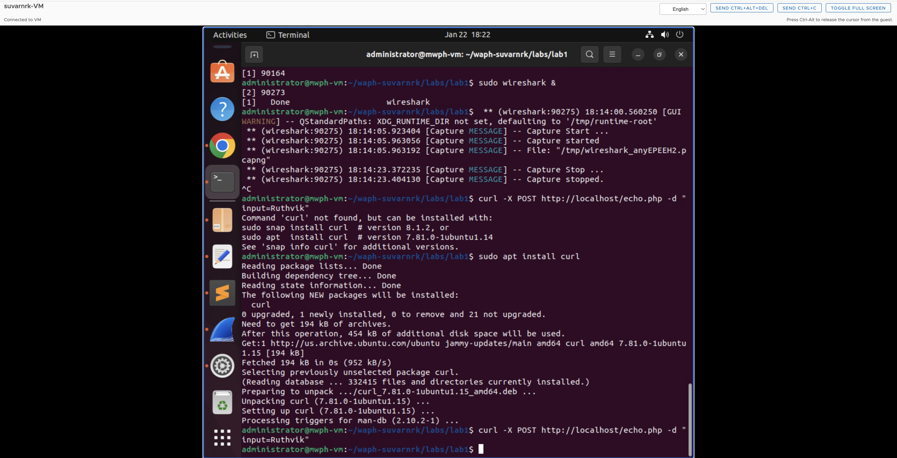
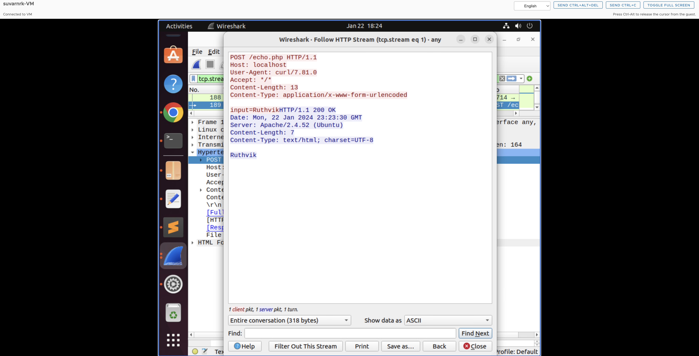

# WAPH-Web Application Programming and Hacking

## Instructor: Dr. Phu Phung

## Student

**Name**: Ruthvik Suvarnakanti

**Email**: suvarnrk@mail.uc.edu


## Lab 1 - Foundations of the WEB

**Overview**: This lab deals with web technologies , HTTP protocol and basic web application programming. Focusing on Wireshark and TELNET for examining the HTTP requests, responses and comparing them with broswer sent requests.
Moving on to the web application programming I got familiarized with develepment of CGI programs in C and incorporating HTML templates. Additionally this lab covers PHP web application development. The final task explores HTTP GET and POST request utilizing wireshark and curl.
The Labs1 report was written in Markdown format and Pandoc tool was used to genearate the PDF report for submission.

[https://github.com/suvarnrk/waph-suvarnrk/blob/main/labs/lab1/README.md](https://github.com/suvarnrk/waph-suvarnrk/blob/main/labs/lab1/README.md)
## Part 1 : The WEB and the HTTP Protocol

### Task 1. Familiar with the Wireshark tool and HTTP protocol

Wireshark is a protocol Analyzer tool which is used for network analysis and troubleshooting. After installing the wirshark in Ubuntu VM , I have clicked on the capture options (4th icon)  selected any on the input interface and enabled the promiscous mode on filters checkbox. Now started to capture the packets and filtered HTTP protocol  among all the other protocols.Then , respective HTTP requests and responses are selected to analyze and observe the HTTP stream.
The HTTP request gives the information about the type of request, target URL , HTTP version, content-type , authorization and the data that is sent to the web servers.
The HTTP response gives the information about staus code, status text , content-type and the data that is sent back to the web browser etc.







## Task 2. Understanding HTTP using telnet and Wireshark

Wireshark was started to capture the network packets before making the HTTP request to exmaple.com/index.html via TELNET through the terminal. For using the TELNET first the connection was established to the exmaple.com webserver through the syntax telnet example.com portNumber. After the connection is established the type of request , path file , http version and host name were given for making the HTTP Request. And the response was received after clicking on the enter twice.


Comparing the HTTP requests through browser and TELNET in wireshark, it is noted that server fields were missing in the telnet made request .
The telnet HTTP request is manually constructed where as in the browser sent request the browser automatically populates request headers such as user-agent, accept, accept-language, authorization , encoding and content etc.


both the HTTP responses in wireshark through browser and TELNET were same.




## Part II - Basic Web Application Programming

### Task 1: CGI Web applications in C

A. I have developed a basic CGI program in C which just prints Hello world! , I have compiled this using gcc and deployed the generated cgi file by copying it to usr/lib/cgi-bin before accessing it on localhost/cgi-bin/helloWorld.cgi in the browser.



B. Now , I have developed another CGI programming in C, this time incorporting a basic HTML template in the C code . This template has the course name as title, student name as Heading and other details as paragraph. This file was also compiled using gcc and copied to usr/lib/cgi-bin before accessing on the browser.


Included file `helloworld.c`:
```C
    #include<stdio.h>
    int main() {
    const char *htmlContent = "<!DOCTYPE html> <html> <head> <title>Web Application Programming and Hacking</title>"
                              "</head> <body> <h1>Student: Tulasiram Nakkanaboina</h1>"
                              "<p>This exercise is done as part of Lab1 assessment i.e CGI Web Applications with C.</p></body></html>";

    printf("Content-Type: text/html\n\n");
    printf("%s", htmlContent);
    return 0;
}
```

### Task 2: A simple PHP Web Application with user input.

A. As part of this task , a PHP web application has been developed with basic syntax which includes my name and PHP version , deployed it to the root apache2 var/www/html directory . It was then accessed on the browser with the url IP address/helloworld.php


Included file `helloworld.php`:
```PHP
<?php
    echo "Hello World! This is my first PHP program, Tulasiram Nakkanaboina , WAPH";
?>
```

B. A simple echo web application in PHP has been developed which prints the path variable passed through the http request.
using $_REQUEST('data') in PHP for capturing the path variables in GET and POST requests possess various secrurity vulnerabilities such as data tampering, SQL injections and Remote Code Execution. By implementing input validation , prepared statments for SQL inputs and sanitizing the usser inputs can mitigate these risks.



Included file `echo.php`:
```PHP
<?php
    $inputData = $_REQUEST["data"];
    echo "The input from the request is <strong>" . $inputData . "</strong>.<br>";
?>
```

### Task 3: Understanding HTTP GET and POST requests.

A.By default the call that was made through the browser was a HTTP GET call and the path variable was passed using ? in the URL IPaddress/echo.php?data="value". The input varaible was then disaplyed as part of the response. This request, response and HTTP stream were analyzed through wireshark. 


B.Client URL of CUrl is a command line tool for processing data using various n/w protocols. I have used CURL in terminal to make a post request to echo.php.

curl -X POST localhost/echo.php -d "input= Ruthvik"






C.The similarities and differences between HTTP GET/ POST requests and respones
Similarities:
Both are HTTP methods used to communicate between client and server.
Both can be captured and analyzed using tools like Wireshark.
Both have request headers (though the headers might differ).
Both receive responses with status codes, headers
Differences:
In GET request data is sent in the URL whereas in the POST request data is sent in the HTTP body.
POST is more secure as data is not exposed to normal users.
GET is used for retreiving the information, whereas POST is used to updated the information .

as the echo.php web application is a mirror application , i.e just printing the recieved input , the responses in both the HTTP GET and HTTP POST are identical.

Post this Labs/Lab1 folder was created to accomodate the project report and the changes were pushed. Pandoc tool was used to generate the project report from the README.md file
