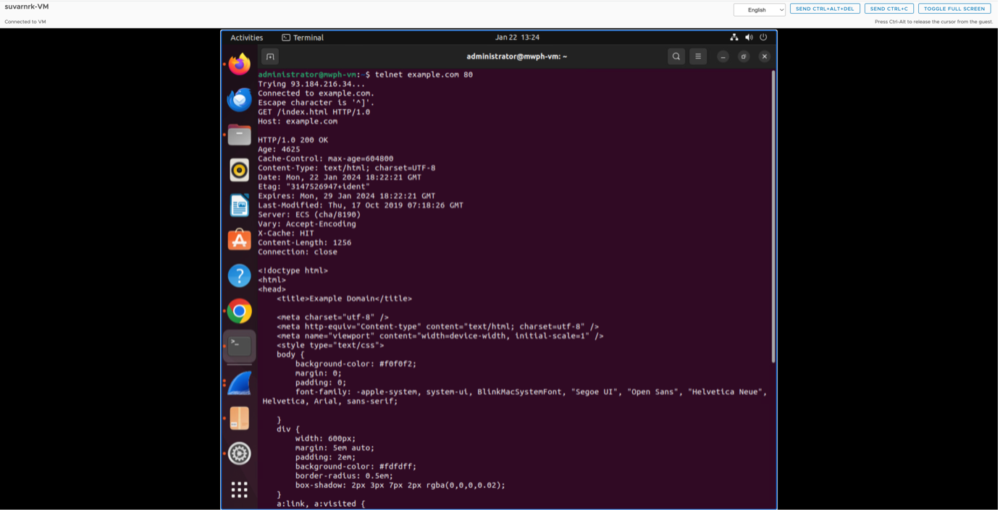
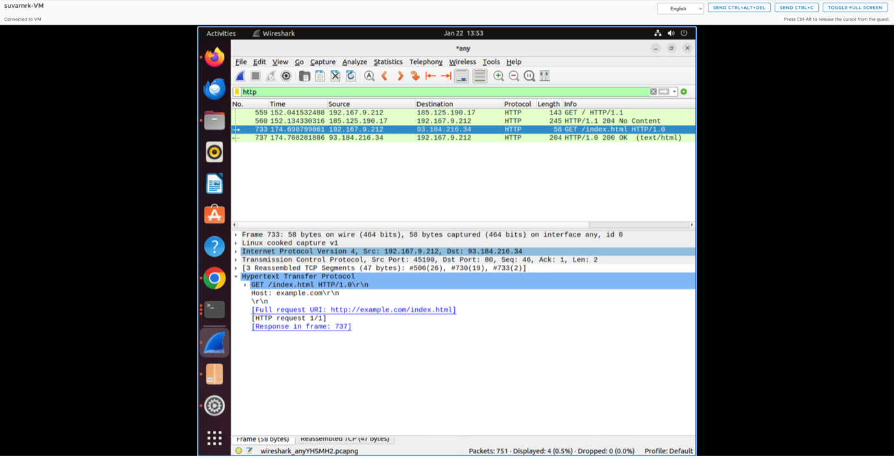
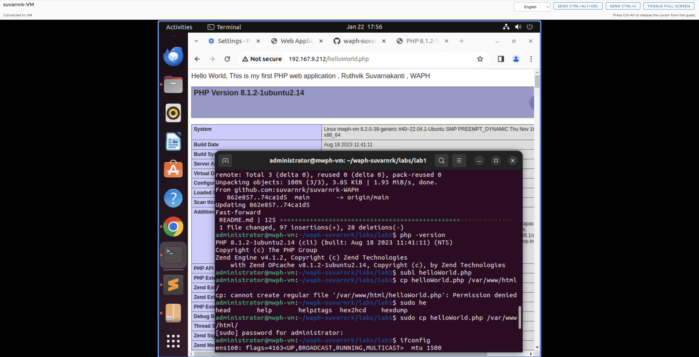
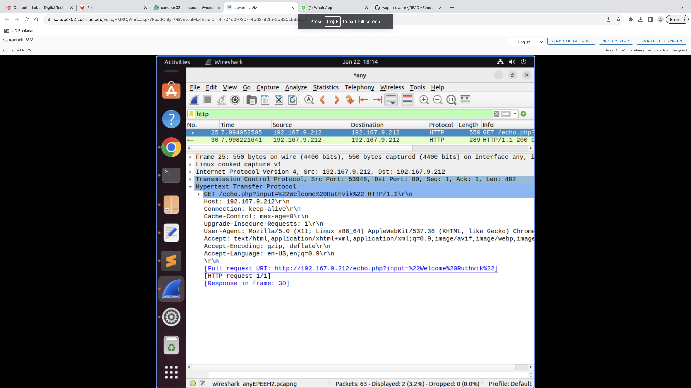
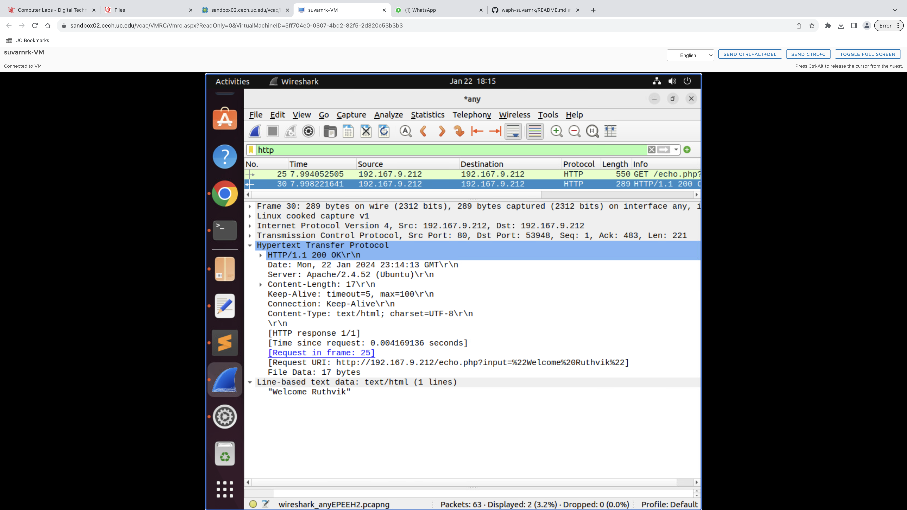

# WAPH-Web Application Programming and Hacking

## Instructor: Dr. Phu Phung

## Student

**Name**: Ruthvik Suvarnakanti

**Email**: suvarnrk@mail.uc.edu

{ width=150px height=150px }

## Lab 1 - Foundations of the WEB

**Overview**: This lab deals with web technologies , HTTP protocol and basic web application programming. Focusing on Wireshark and TELNET for examining the HTTP requests, responses and comparing them with broswer sent requests.
Moving on to the web application programming I got familiarized with develepment of CGI programs in C and incorporating HTML templates. Additionally this lab covers PHP web application development. The final task explores HTTP GET and POST request utilizing wireshark and curl.
The Labs1 report was written in Markdown format and Pandoc tool was used to genearate the PDF report for submission.

[https://github.com/suvarnrk/waph-suvarnrk/blob/main/labs/lab1/README.md](https://github.com/suvarnrk/waph-suvarnrk/blob/main/labs/lab1/README.md)

## Part 1 : The WEB and the HTTP Protocol

### Task 1. Familiar with the Wireshark tool and HTTP protocol

A popular tool for analyzing network packets and protocols, Wireshark records and shows intricate packet data to aid with network problems. Installing it on Ubuntu virtual machines, checking the version, and using it to examine and solve network problems are all possible. Firstly, Install Wireshark in ubuntu using commands from terminal. Open the Wireshark and filter the captures with “any” using which results in all traffics happening. Filter the displaying packets using “http”. Give a request in the browser , here I have given “http://example.com/index.html” as a request and observed the packets in the Wireshark by filtering http in the displayed packets. There will be a HTTP GET request and HTTP response for the request given in browser, we need to capture those packets as part of one this module.


### Task 2. Understanding HTTP using telnet and Wireshark

Wireshark was started to capture the network packets before making the HTTP request to exmaple.com/index.html via TELNET through the terminal. For using the TELNET first the connection was established to the exmaple.com webserver through the syntax telnet example.com portNumber. After the connection is established the type of request , path file , http version and host name were given for making the HTTP Request. And the response was received after clicking on the enter twice.



Telnet, a network application utilizing the telnet protocol, facilitates TCP connections to servers for data exchange. In this task we will be requesting the example.com/index.html through telnet instead of using browser request. Connection should be established firstly between the telnet and example.com webserver using command “telnet example.com 80” here 80 is the port number. After a successful connection is established, GET command and Host commands are entered manually to get the required response. 



The HTTP replies in Wireshark were identical whether viewed using a browser and TELNET.


## Part 2 - Basic Web Application Programming

### Task 1: CGI Web applications in C

A. CGI is a commonly used protocol allowing web servers to communicate with external applications by executing them as command-line programs. To write a C "Hello World!" CGI program, write a script that outputs "Hello World CGI! From Ruthvik Suvarnakanti, WAPH." The code may be run as a standard binary application and built using gcc installable with “$ sudo apt install gcc”. After creating a helloworld.c program copy it to the helloworld.cgi in cgi-bin folder. After entering the commands, enter ” http://localhost/cgi-bin/helloworld.cgi “  you will get the response in the browser for which the code you entered.


B. I enhanced my CGI programming in C by integrating a basic HTML template featuring the course name as the title and student details. After compiling the code with gcc, I placed the resulting file in usr/lib/cgi-bin for browser access.


Included file `helloworld.c`:
```C
    #include<stdio.h>
    int main() {
    const char *htmlContent = "<!DOCTYPE html> <html> <head> <title>Web Application Programming and Hacking</title>"
                              "</head> <body> <h1>Student: Ruthvik Suvarnakanti</h1>"
                              "<p>This exercise is done as part of Lab1 assessment i.e CGI Web Applications with C.</p></body></html>";

    printf("Content-Type: text/html\n\n");
    printf("%s", htmlContent);
    return 0;
}
```

### Task 2: A simple PHP Web Application with user input.

A. In the labs/lab1 folder of your private repository, create a new file named helloworld.php. The file should contain content that utilizes the echo language construct in PHP for printing strings from texts or expressions. The echo construct can be employed with or without parentheses, wrapping texts within either double or single quotes. Additionally, phpinfo() is included to display PHP information on the server for testing purposes only. Deploy the code to the root directory of the webserver using the following commands$ cd <path-to-the-folder> $ sudo cp helloworld.php /var/www/html
Browsers should be able to view the deployed page at http://<192.167.9.212>/helloworld.php.



Included file `helloworld.php`:
```PHP
<?php
    echo "Hello World! This is my first PHP program, Ruthvik Suvarnakanti , WAPH";
?>
```

B. Using the echo function, I've developed a simple PHP web application that outputs the path variable obtained from HTTP queries. It's crucial to remember that using PHP's $_REQUEST('data') to record path variables in GET and POST requests exposes you to security flaws including remote code execution, SQL injections, and data manipulation. It is essential to apply input validation, use prepared statements for SQL inputs, and sanitize user inputs in order to reduce these risks.


Included file `echo.php`:
```PHP
<?php
    $inputData = $_REQUEST["input"];
    echo $inputData ;
?>
```

### Task 3: Understanding HTTP GET and POST requests.

A. The call made by the browser was a standard HTTP GET request, and it used the "?" character in the URL syntax i.e., IPaddress/echo.php?input="value" to send the path variable. The result included the input variable after that. Wireshark was used to examine the request itself, the response, and HTTP stream in its entirety. 






B. A command-line program called Client URL (cURL) is intended for data processing over various network protocols. In this case, I sent a POST call to the echo.php endpoint using cURL in the terminal. This required utilizing the cURL command-line tool to deliver data to the server using the HTTP POST protocol.

curl -X POST localhost/echo.php -d "input= Ruthvik"


C.An analysis tool such as Wireshark may be used to compare the similarities between HTTP GET and POST requests, which are essential for client-server communication and contain request headers and response codes. Interestingly, they communicate data differently: POST uses the HTTP body, whereas GET uses the URL. GET is usually used for retrieving, whereas POST is used for updating, and POST is seen to be more secure. The GET and POST replies in the echo.php web application are the same. The project report also had a Labs/Lab1 folder created for it, and the README.md file was used to construct the report using the Pandoc tool.
