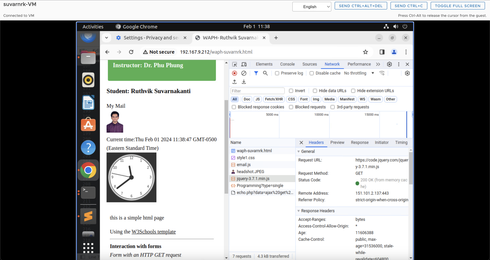

# WAPH-Web Application Programming and Hacking

## Instructor: Dr. Phu Phung

## Student

**Name**: Ruthvik Suvarnakanti

**Email**: suvarnrk@mail.uc.edu

{ width=150px height=150px }

## Lab 2 - Front End Web Development

**Overview**: In this hands-on web development lab, we begin by constructing a simple HTML page, tossing in essential tags and forms to lay the groundwork. Then, we delve into JavaScript, tackling it from various angles: embedding it directly, using the script tag, linking to an external file, and even pulling code from a remote repository. To tackle up the look of our webpage, we play around with CSS – going for inline, internal, and external styles to make things visually appealing. Now, here comes jQuery, our trusty sidekick. It helps us pull off some slick AJAX calls, reaching out to the echo.php file that is needed to be reused from lab 1 for some asynchronous action. But we're not stopping there. We bring in two web services using jQuery and the fetch method – one for serving up random jokes and the other for taking a crack at guessing ages. And to put the finishing touches on our project, we enlist Pandoc to effortlessly transform our README.md into a published PDF file.

[https://github.com/suvarnrk/waph-suvarnrk/blob/main/README.md](https://github.com/suvarnrk/waph-suvarnrk/blob/main/README.md)

## Part 1 : Basic HTML with forms, and JavaScript

### Task 1. HTML


As part of this task, we developed a basic HTML webpage named "waph-suvarnrk.html." The webpage incorporates essential tags like <h1>, <h2>, <h3>, <a>, , and <form>. These tags structure the content, create headings, hyperlinks, and images, making the webpage interactive and visually appealing.

Included file `waph-suvarnrk.html`:
```HTML
<!DOCTYPE html>
<html>
<head>
<meta charset="utf-8">
<title>WAPH- Ruthvik Suvarnakanti</title>
</head>
<body>
<div >
	<div id="top">
		<h1>Web Application Programming and Hacking</h1>
		<h2>Front End Development Lab </h2>
		<h3>Instructor : Dr Phu Phung</h3>
	</div>
	<div >
		<div id="menubar">
		<h3>Student : Ruthvik Suvarnakanti</h3>
		
		</div>
		<div id="main">
			<p>A Simple HTML Page</p>
			Using the <a href="https://www.w3schools.com/html">W3 Schools Template</a>
			<hr>
			<b>Interaction with forms</b>
		<div>
			<i> Form with an HTTP GET request</i>
			<form action="/echo.php" method="GET">
				Your Input: <input name="input">
				<input type="submit" value="Submit">
			</form>

		</div>
		<div>
			<i> Form with an HTTP POST request</i>
			<form action="/echo.php" method="GET" name="echo_post">
				Your Input: <input name="input" onkeypress="console.log('You pressed a key')">
				<input type="submit" value="Submit">
				
			</form>
			</div>
		</div>
	</div>
</div>		
</body>
</html>
```


### Task 2. Simple JavaScript

In this task, we got a simple introduction to JavaScript syntax and explored various methods of adding JavaScript code into an HTML file. We played around with Inline JS, where we wrote code to show the current date and time when clicked. Additionally, we logged the click event on the console for a bit of behind-the-scenes action.


```HTML
 	 <div>
		<hr>
		<b>Experiments with Javascript</b><br>
		<i>Inlined JavaScript</i>
		<div id="date" onclick="document.getElementById('date').innerHTML= Date()"> 		 Click here to Show Date()</div>
	</div>
```


-JavaScript code in a <script> tag to display a digital clock.
```HTML
  <script type="text/javascript">
			function displayTime(){
				document.getElementById('digit-clock').innerHTML ="Current time:" + new Date();
			}
			setInterval(displayTime,500);
		</script>
```
 
-JS code in JS file and and code in HTML page to show or hide email when clicked.
```JavaScript
	var shown=false;
function showhideEmail(){
	if(shown){
		document.getElementById('email').innerHTML="Show ny email";
		shown =false;
	}else{
		var myemail="<a href='mailto:suvarnrk"+"@"+"mail.uc.edu'>suvarnrk"+"@"+"mail.uc.edu</a>";
		document.getElementById('email').innerHTML=myemail;
		shown=true;
	}
}
	
```

```HTML
	<div id="email" onclick="showOrHideEmail()">Show my email</div>
	<script type="text/javascript" src="email.js"></script>
```


-Displaying an Analog clock with an external Javascript code and code in HTML page.
```HTML
<canvas id="analog-clock" width="150" height="150" style="background-color:#999"></canvas>
<script src="https://waph-uc.github.io/clock.js"></script>
<script type=text/javascript>
			const canvas = document.getElementById("canvas");
const ctx = canvas.getContext("2d");
let radius = canvas.height / 2;
ctx.translate(radius, radius);
radius = radius * 0.90
setInterval(drawClock, 1000);

function drawClock() {
  drawFace(ctx, radius);
  drawNumbers(ctx, radius);
  drawTime(ctx, radius);
}
</script>
```


## Part II - Ajax, CSS, jQuery, and Web API integration

### Task 1: Ajax


We wrote HTML code that captures user input and uses AJAX to make a GET call to echo.php. The received response is then showcased within a designated div. Since it's a GET call, the input was transmitted as a path variable in the URL.

```HTML
	<div>
		<i> Ajax Requests</i><br>
		Your Input: 
		<input name="data"
		onkeypress="console.log('You have pressed a key ')" id="data">
		<input type="button" class="button round" value="Ajax Echo" onclick="getEcho()">
		<div id="response"></div>
			<input class="button round" type="submit" value="JQuery Ajax Echo" onclick="getJqueryAjax()">
				<input class="button round" type="submit" value="JQuery Ajax Echo Post" onclick="getJqueryAjaxPost()">
				<input class="button round" type="submit" value="Guess Age" onclick="guessAge($('#data').val())">
				<div id="response"></div>
	</script>
```
We examined the Ajax call response in the inspect view, observing that the request method was GET, the status code indicated a successful 200 OK, and the input data was transmitted within the URL.


### Task 2: CSS

**a)** Inline CSS
```HTML
<body style="background-color: powderblue;">
<h1 style="color: blue;">Web Application Programming and Hacking</h1>
```


**b)** Internal CSS.
```HTML
	<style>
		.button{
			background-color:green;
			border: none;
			color: white;
			padding: 5px;
			text-align: center;
			text-decoration: none;
			display: inline-block;
			font-size: 12px;
			margin: 4px 2px;
			cursor: pointer;
		}
		.round{border-radius: 8px;}
		#response{background-color: orange;}
		}
	<!-- HTML code -->
	</style>
	input class="button round" type="submit" value="JQuery Ajax Echo" onclick="getJqueryAjax()">
				<input class="button round" type="submit" value="JQuery Ajax Echo Post" onclick="getJqueryAjaxPost()">
				<input class="button round" type="submit" value="Guess Age" onclick="guessAge($('#data').val())">
	<div id="response"></div>
```
**c)** External CSS from the remote repository provided in the lecture.[https://waph-uc.github.io/style1.css](https://waph-uc.github.io/style1.css).

```HTML
	<link rel="stylesheet" type="text/css" href="https://waph-uc.github.io/style1.css">
	<!-- HTML code -->
	<div class="container wrapper">
	<!-- HTML code -->
		<div class="wrapper">
	<!-- HTML code -->
		</div>
	</div>
```


### Task 3: JQuery
We included the jQuery library in the HTML code, incorporating two buttons one for jQuery Ajax GET and the other for jQuery Ajax POST. These buttons are designed to initiate GET and POST calls, respectively, to echo.php using jQuery. In the case of the Ajax GET request to echo.php, we inspected the response in the view, noting that it was a GET call with a status code of 200 OK.

**i.** Ajax GET request to echo.php , the response is analyzed in the inpect view. The call was GET and status code was 200OK.

```HTML
	<!-- HTML code -->
	<input class="button round" type="submit" value="JQuery Ajax Echo" onclick="getJqueryAjax()">
	<!-- HTML code -->
	<script>
		function getJqueryAjax(){
			var input=$("#data").val();
				if(input.length==0)
					return;
			$.get("echo.php?data="+input,
				      function(result){
					      printResult(result);
						});
			$("#data").val("");
			}
		function printResult(result){
			$("#response").html(result);
			}
	</script>
```


**i.** Ajax POST request to echo.php , the response is analyzed in the inpect view. The call was POST and status code was 200OK.

```HTML
	<!-- HTML code -->
	<input class="button round" type="submit"
		value="JQuery Ajax Echo Post" onclick="getJqueryAjaxPost()">
	<!-- HTML code -->
	<script>
		function getJqueryAjaxPost(){
			var input=$("#data").val();
			if(input.length==0)
				return;
			$.post("echo.php",{data:input},function(result){
					printResult(result);
					});
			$("#data").val("");
			}
		function printResult(result){
			$("#response").html(result);
			}
	</script>
```


### Task 4: WEB API Integration.

**i.** Using Ajax on [https://v2.jokeapi.dev/joke/Programming?type=single](https://v2.jokeapi.dev/joke/Programming?type=single)


We wrote JavaScript code with jQuery Ajax to make a GET call to the specified web service. After receiving the response in JSON format, we converted it to a string and displayed it in the console. To extract the joke from this response, we used the result.joke property. This service generates a different random joke each time the webpage is refreshed, adding a touch of humor to the user experience.


The below picture represents image of randomly created joke when page is loaded.


```HTML
	<!-- HTML code -->
	<script>
	$.get("https://v2.jokeapi.dev/joke/Programming?type=single",function(result){
				console.log("from joke API: "+ JSON.stringify(result));
				$("#response").html("Programming joke of the day: " +result.joke);
				});
	</script>
	<!-- HTML code -->
```


**ii.** Using the `fetch` API  on [https://api.agify.io/?name=input](https://api.agify.io/?name=input)

In JavaScript, the fetch method is employed to initiate an HTTP request to the mentioned web service. Since this is an asynchronous call, the function is marked with the async keyword, and await is utilized to coordinate the response. The HTTP request executed is of the GET type, and a 200 OK status code confirms the success of the operation.

```HTML
	<script>
	async function guessAge(name){
				const response= await fetch("https://api.agify.io/?name="+name);
				const result= await response.json();
				$("#response").html("Hello "+name+" ,your age should be "+result.age);
			}
	</script>
```

The pictures of API calls are not responsive as there are too many request to API and gettting a status of 429 which is meant for request limit reached. I am attaching the pictures of the same here.


Below is the response of the API call.


Below is the final webPage after completing all the tasks and following the lectures.


Following the completion of the lab, a directory named "Lab2" was established to house both the project report and related files. Subsequently, these modifications were pushed to the repository. The project report was generated from the README.md file using the Pandoc tool.
