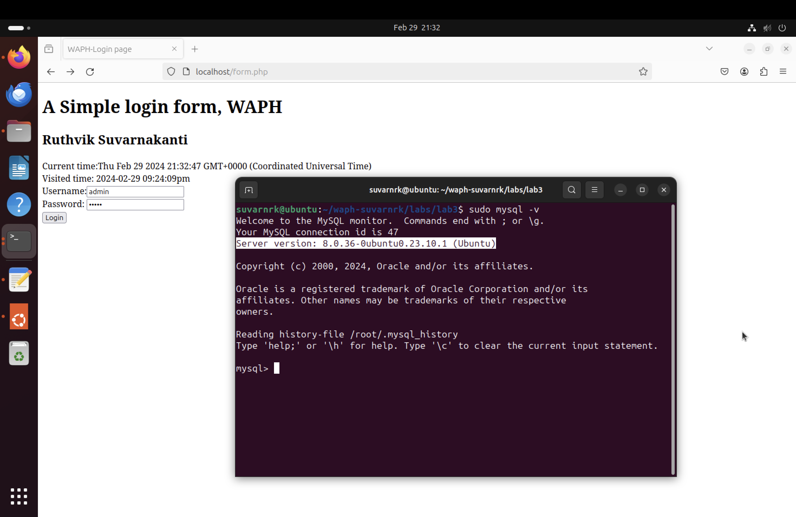
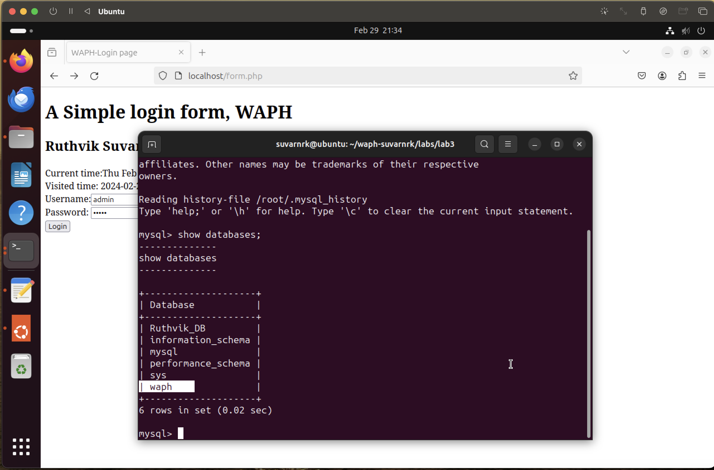
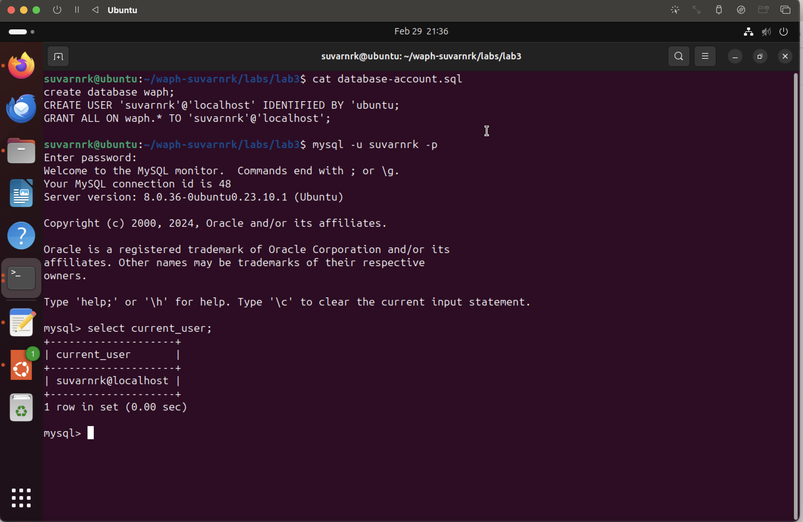
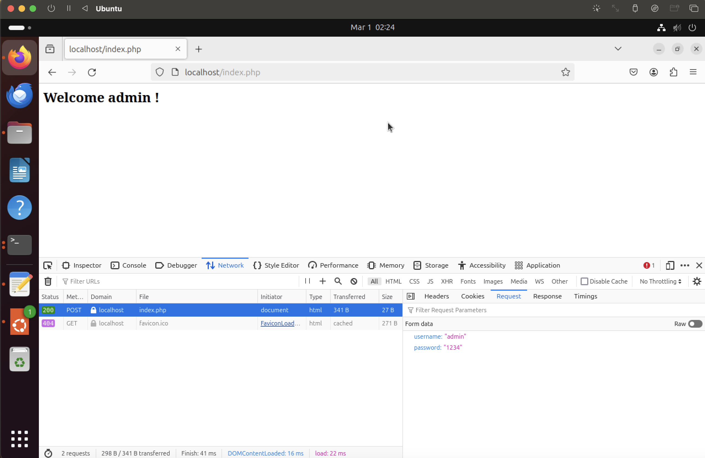
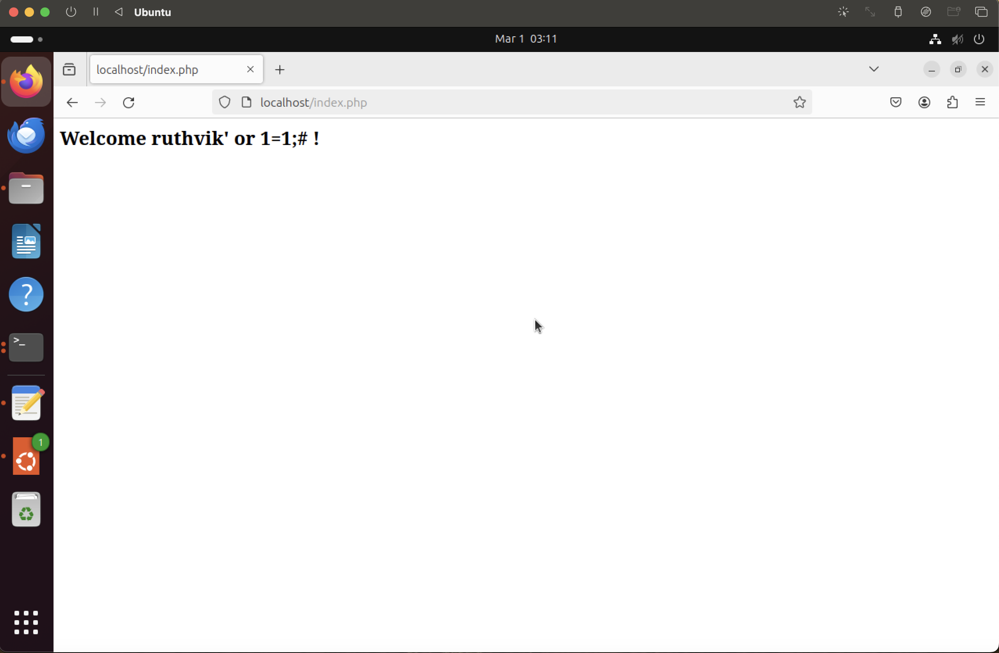
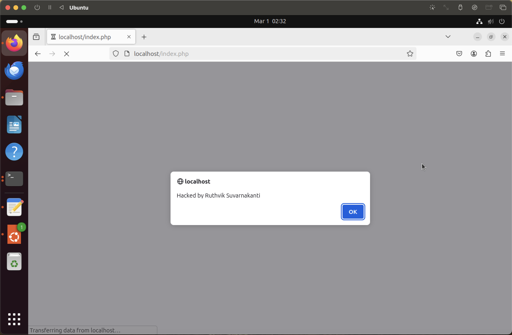
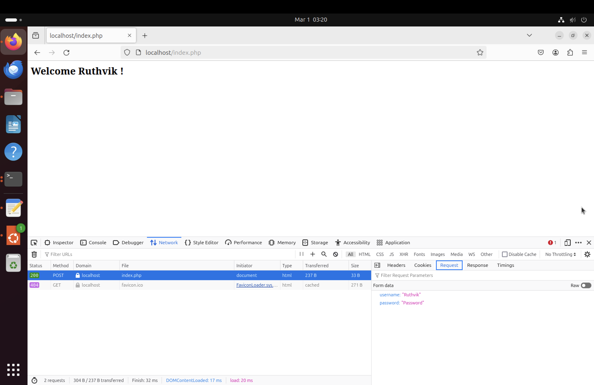
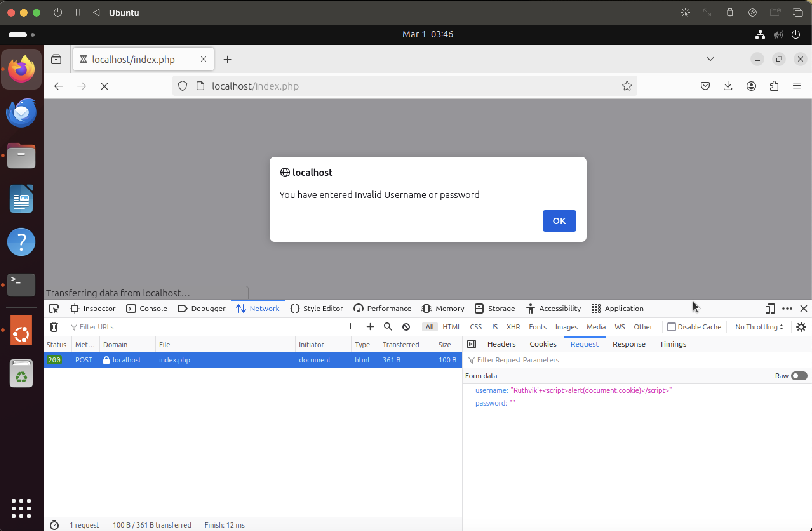

# WAPH-Web Application Programming and Hacking

## Instructor: Dr. Phu Phung

## Student

**Name**: Ruthvik Suvarnakanti

**Email**: suvarnrk@mail.uc.edu


## Lab 3 - Secure Web Application Development in PHP/MySQL

**Overview**: The lab starts with setting up a basic database and making a simple login system using PHP and MySQL. It then dives into exploring common vulnerabilities like SQL Injection and Cross-Site Scripting (XSS), letting participants understand by actually exploiting them. Through hands-on practice, participants learn to spot and take advantage of weaknesses in the login system, getting a real feel for web application security issues. After uncovering these vulnerabilities, the focus turns to applying security measures like prepared statements and output sanitization to minimize risks. Overall, the lab gives a full learning experience, mixing theory with practical skills for building and protecting web applications effectively.


Link to the repository:
[https://github.com/suvarnrk/waph-suvarnrk/blob/main/labs/lab3/README.md](https://github.com/suvarnrk/waph-suvarnrk/blob/main/labs/lab3/README.md)

\pagebreak

## Database Setup and Management

### MySQL Installation

The MySQL server is installed via the command `sudo apt-get install mysql-server -y`. Connection to the MySQL server is established using `sudo mysql -u root -p`, requiring authentication with the root user's password. This setup enables interaction with the MySQL server for database management and query execution.



### Create a New Database, Database User and Permission

A new database named WAPH has been created. Within this database, a user named 'suvarnrk' has been established, and full permissions have been granted to this user account for the WAPH database. This setup allows the suvarnrk user to perform all operations within the WAPH database, including creating, modifying, and deleting tables, as well as executing queries and managing data.



The SQL commands used to acheive this are as follows:

Included file `database-account.sql`

```SQL
create database waph;

CREATE USER 'suvarnrk'@'localhost'
IDENTIFIED BY 'ubuntu';

GRANT ALL ON waph.* TO 'suvarnrk'@'localhost';
```



\pagebreak

### Create a new table `Users` and insert data into the table
A new table named 'Users' has been established, and data has been inserted into this table using SQL commands. To enhance security, the md5() hash function has been employed to generate 128-bit hash values for the passwords before storing them in the database. This cryptographic technique ensures that the passwords are securely stored in a hashed format, providing an additional layer of protection against unauthorized access.

Included file: `database-data.sql`
``` SQL

create table users(
username varchar(50) PRIMARY KEY,
password varchar(100) NOT NULL);

INSERT INTO users(username,password) VALUES ('admin',md5('mypass'));
```


\pagebreak

## B. A Simple (Insecure) Login System with PHP/MySQL
The installation of the PHP MySQLi extension was completed by running the command `sudo apt-get install php-mysqli`. To ensure the changes take effect, the Apache web server was restarted using the command `sudo service apache2 restart`. This ensures that the PHP environment is correctly set up to utilize MySQLi functionality, facilitating smooth communication between PHP scripts and MySQL databases, thus enhancing the capabilities of web development projects.



checklogin_mysql() function with SQLi vulenrability:
```PHP
function checklogin_mysql($username, $password) {
    $mysqli = new mysqli('localhost', 'suvarnrk', 'ubuntu', 'waph');
    if ($mysqli->connect_error) {
        die("Connection failed: " . $mysqli->connect_error);
    }
    $sql = "SELECT * FROM users WHERE
    username= '".$username."' AND password = MD5('".$password."')";
    $result = $mysqli->query($sql);
    if ($result->num_rows == 1) {
        return TRUE;
    } else {
        return FALSE;
    }
}
```
File included `Form.php`

```HTML
<form action="index.php" method="POST" class="form login">
Username: <input type="text" class="text_field" name="username" /> <br>
Password: <input type="password" class="text_field" name="password" /> <br>
<button class="button" type="submit"> Login </button>
```
\pagebreak

## Performing XSS and SQL Injection Attacks

### SQL Injection Attack
SQL injection is a common attack vector where attackers exploit vulnerabilities in the handling of user inputs to manipulate SQL queries. In your example, the SQL injection is achieved by appending `Ruthvik' or 1=1; #` to the username field. This extra condition, `or 1=1`, is always true and causes the SQL query to return all results, effectively bypassing authentication and granting unauthorized access to the application.

This vulnerability arises from insecure concatenation of user inputs into SQL statements without proper validation or parameterization. When untrusted input, such as form fields or URL parameters, is directly concatenated into SQL queries, attackers can inject malicious SQL code. This injected code can alter the query's behavior, allowing attackers to execute arbitrary commands, retrieve sensitive data, or modify the database structure.

To mitigate SQL injection, it's crucial to implement robust input validation and utilize parameterized queries. Input validation ensures that user inputs meet expected criteria, while parameterized queries separate SQL logic from user data, preventing injection attacks by treating user input as data rather than executable code. By adopting these security measures, web applications can defend against SQL injection and safeguard sensitive data.



### Cross-site Scripting (XSS)
In the web application, someone has injected a script to display an alert. This injected script, `admin' #<script>alert('Hacked by Ruthvik Suvarnakanti')</script>`, takes advantage of weaknesses in how the application handles user inputs, like the username field, to run harmful JavaScript code in the browser. 



\pagebreak

## d. Prepared Statement Implementation

### Prepared Statement for SQL Injection Prevention

Prepared statements offer a safeguard in database programming by keeping SQL commands separate from user input. They allow parameters to be handled independently, ensuring that user input is treated purely as data, not executable code. This approach automatically protects against SQL injection attacks by escaping special characters in the input. Essentially, prepared statements help to make database-driven applications more secure by treating user input with caution and preventing malicious code execution.



`checklogin_mysql ` function after implementing the Prepared Statment.
```PHP

function checklogin_mysql($username, $password) {
    $mysqli = new mysqli('localhost', 'suvarnrk', 'ubuntu', 'waph');
    if ($mysqli->connect_error) {
        die("Connection failed: " . $mysqli->connect_error);
    }

    $sql = "SELECT * FROM users
     WHERE username= ? AND password = MD5(?)";
    $stmt = $mysqli->prepare($sql);
    $stmt->bind_param("ss",$username,$password);
    $stmt->execute();
    $result=$stmt->get_result();
    if ($result->num_rows >= 1) {
        return TRUE;
    } else {
        return FALSE;
    }
}
```


\pagebreak

### Security Analysis

Prepared statements offer robust protection against SQL injection attacks by separating SQL commands from user input data. Utilizing parameterized queries, automatic escaping, and parameter binding, they ensure that user input is treated strictly as data, thwarting attempts to inject malicious SQL code into queries and manipulate the database. Furthermore, automatic handling of special characters in user input enhances security by eliminating SQL injection vulnerabilities.

To address XSS vulnerabilities, the code snippet `<h2> Welcome <?php echo $_POST["username"]; ?> !</h2>` in index.php was modified to mitigate the risk. By employing `htmlspecialchars`, special characters are converted into their corresponding HTML entities. This ensures they are interpreted as plain text rather than HTML tags, effectively safeguarding against XSS attacks.

revised code :
`<h2> Welcome <?php echo htmlspecialchars($_POST["username"]); ?> !</h2>`



\pagebreak


The code lacks validation for empty username or password fields before processing them in the checklogin_mysql() function. This oversight may result in unexpected behavior or errors if the user submits the form without entering any data.

While the code handles failed database connections with $mysqli->connect_error, it overlooks other potential database errors that could occur during query execution. For instance, errors in SQL query syntax or database server issues are not properly handled, leading to silent failures without user feedback.

Storing passwords using MD5 hashing without salting poses security risks. MD5 is vulnerable to brute-force and rainbow table attacks due to its speed. It's advisable to use stronger hashing algorithms like bcrypt or Argon2 with unique salts for each password to enhance security.

The code retrieves user records from the database where the username and password must match the input exactly, making usernames case-sensitive. This may lead to authentication issues if the stored username differs in case from the one provided by the user.
