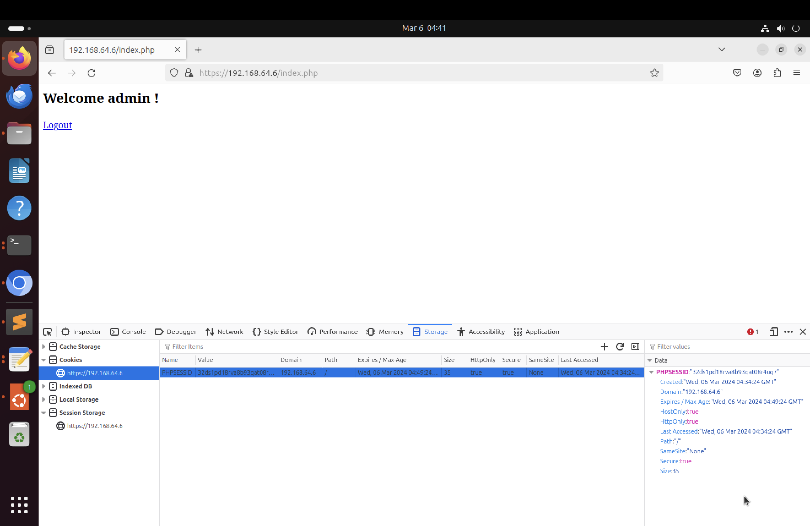

# WAPH-Web Application Programming and Hacking

## Instructor: Dr. Phu Phung

# WAPH-Lab 4: A Secure Login System with Session Authentication

**Name**: Ruthvik Suvarnakanti

**Email**: suvarnrk@mail.uc.edu

{ width=150px height=150px }

## Overview

The tasks in this lab4 are about learning and implementing secure session management in PHP web applications. In Task 1, we'll set up and test `sessiontest.php`, and use Wireshark to understand how sessions are handled between clients and servers. We'll also explore the risks of session hijacking. Task 2 involves updating a login system to ensure it's secure and protected against session hijacking attacks. Finally, Task 3 focuses on making sessions and authentication more secure by setting up HTTPS for data protection and implementing measures to prevent session hijacking. These tasks aim to help us understand and implement robust security practices in web development.

## Task 1: Understanding Session Management in a PHP Web Application

We have employed session management in our lab using sessionstest.php file where it represents the number of time user have visited the page. It start with the session_start() and eventually the session is incremented by every time the user visits the page.These sessions often vary with different browsers.

### 1.a. Deploy and test `sessiontest.php` 

To comply with the task requirements, we first clone the course repository to our local machine and locate the `sessiontest.php` file. After ensuring it meets the specified criteria and making any necessary revisions, we deploy it to our web server. We copy the file to the appropriate directory and access it through a web browser using the server's URL. We then test the functionality of `sessiontest.php` as instructed, ensuring session management works correctly. To access it through different web browsers, we simply open multiple browser instances and navigate to the same URL. This process allows us to observe any discrepancies in behavior across browsers and ensures the session management functionalities are robust and consistent.

\pagebreak

### 1.b. Observe the Session-Handshaking using Wireshark 

To utilize Wireshark for capturing traffic while accessing `sessiontest.php`, start by clearing browser cookies to avoid interference from existing sessions. Then, initiate Wireshark and select the relevant network interface, applying a capture filter if necessary to focus on HTTP traffic. Begin capturing packets and access `sessiontest.php` through a web browser, performing required actions to trigger session handling. Analyze captured packets, focusing on HTTP requests and responses related to session handling.Firstly analyze packets of first HTTP request and then analyze the packets of the next HTTP request/response. Examine the initiation of sessions in the initial requests and subsequent interactions to observe session maintenance.  This process provides insights into the session handling mechanisms employed by `sessiontest.php`.

\pagebreak

### 1.c. Understanding Session Hijacking 

To perform session hijacking, first, open the webpage in Chrome. Then, right-click and choose "Inspect" to open Developer Tools. Go to the Console tab and allow pasting if prompted. Next, type in the provided code, replacing `<value>` with the session ID you've obtained. After that, refresh the page to execute the hijacking. Take  screenshot  showing the code execution in the console and  displaying the consequences of the hijacked session, like accessing restricted content.

\pagebreak

## Task 2: Insecure Session Authentication

### 2.a. Revised Login System with Session Management 

**Attention: Lab 4 is based on Lab 3; you must have Lab 3 code completed first**

To improve the  login system in previous workings for managing authenticated sessions, changes are made mainly to `index.php`. Initially, it verifies whether the user provides a username and password, confirming them against the MySQL database. If successful, the session is marked as authenticated, and the username is stored. In case of failure, an alert is triggered, the session is cleared, and the user is redirected to the login form. Additionally, it checks if the login session exists; if not, it alerts the user and redirects them to the login form. Once authenticated, a personalized welcome message is shown using the username from the session, alongside a logout link leading to `logout.php`. In `logout.php`, all session data is wiped before sending the user back to the login form. These updates ensure more secure session management and user authentication, enhancing both functionality and security aspects of the system.

\pagebreak

### 2.b. Session Hijacking Attacks 

In this task, we will be logged in into Firefox,  tries to exploit a stolen session ID to access the system without proper credentials. Initially unable to log in due to lacking the required username and password, the attacker sets the stolen session ID as a cookie and revisits the `index.php` page, bypassing the need for authentication. This illustrates how vulnerable the system is to session hijacking attacks, underscoring the necessity for implementing strong security measures to prevent such breaches.

\pagebreak

## Task 3: Securing Session and Session Authentication

### 3.a. Data Protection and HTTPS Setup 

To set up HTTPS on Apache2,
First, generating a public and private key pair by creating a new folder named `sslkey` in our repository and using the `openssl` command to create the key pair. Next, configure HTTPS in Apache2 by copying the generated `waph.crt` and `waph.key` files to the appropriate directories and editing the `default-ssl.conf` file to specify the SSL certificate and key file paths. Then, enable the Apache SSL module and the edited SSL configuration, and restart the Apache web server. Once configured, access the secure site using the specified URL. You may encounter a security warning about an unknown certificate, but you can proceed by adding an exception and verifying the certificate details. Optionally, we can set up a hostname on Ubuntu by adding our sitename to the hosts file.

\pagebreak

### 3.b. Securing Session Against Session Hijacking Attacks - setting HttpOnly and Secure flags for cookies  

To prevent session hijacking, it's important to implement security measures like adjusting session cookie settings. This includes making sure that session cookies can only be accessed through HTTP and limiting their transmission to HTTPS connections. Additionally, it's beneficial to set a time limit on sessions to reduce the risk of attacks. These settings should be configured before starting a session within PHP scripts, such as `index.php`. Testing the setup involves clearing any existing session cookies and verifying that trying to access the page without valid ones triggers alerts, indicating that the user is not logged in. This helps ensure effective protection against session hijacking and improves overall web application security.

\pagebreak

### 3.c. Securing Session Against Session Hijacking Attacks - Defense In-Depth (7.5 pts).

To make `index.php` more secure we make changes.After confirming authentication, we'll store browser information as a new session variable. Later on, we'll compare this stored browser data with the current browser details. If they don't match, it suggests a possible session hijacking attempt.
These adjustments help enhance protection against unauthorized access, effectively detecting and preventing session hijacking attacks.

